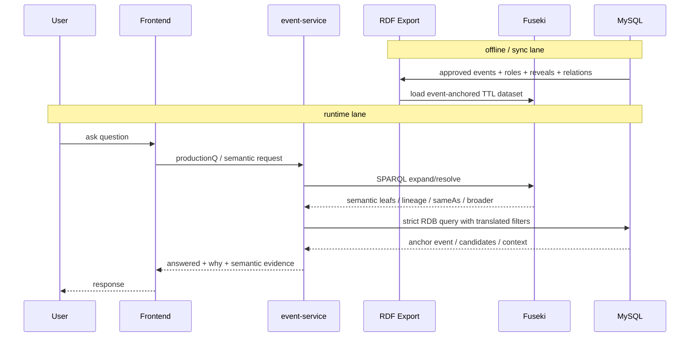

# Generalized SPO Semantic Lane Plan

기준일: 2026-03-04

목적
- 현재 RDB 기반 `SPO-lite`를 유지하면서, Fuseki 기반 semantic lane을 붙여 일반화된 `S / P / O` object typing과 semantic expansion을 런타임에 보조하도록 만드는 계획을 고정한다.
- 완전한 generic SPO query planner로 가기 전까지 필요한 단계, 산출물, 경계를 명확히 한다.

비범위
- strict answer selection을 Fuseki/SPARQL로 직접 교체하지 않는다.
- `PRECEDES` 메인 체인을 triple store로 옮기지 않는다.
- OWL reasoner를 첫 단계 필수 의존성으로 두지 않는다.

## 0) Event-Anchored RDF 원칙

핵심
- ground truth는 계속 RDB event
- RDF/TTL/Fuseki는 **event에서 export한 projection**
- 런타임에서는 Fuseki를 **semantic 보조 lane**으로 조회할 수 있다

즉 구조는 아래처럼 고정한다.

1. `RDB`가 원천 사실(approved event, episode, status, relation)을 가진다
2. export가 `event-anchored TTL`을 만든다
3. TTL을 Fuseki dataset에 load한다
4. runtime에서 event-service가 Fuseki를 semantic expansion/resolver 용도로 질의한다
5. 최종 strict answer selection은 계속 RDB에서 한다

이 원칙의 장점
- K-gate / APPROVED / anchor event는 계속 RDB가 통제
- Fuseki는 alias/sameAs, object typing, reveal/predicate inheritance, org lineage 같은 semantic 그래프 질의에 집중
- Fuseki 장애 시 RDB-only fallback이 가능

### 0.1 시퀀스

### 0.2 Event-anchored RDF shape

권장 shape
- `:E123 a :Event`
- `:E123 :episodeStart 1 ; :episodeEnd 3 ; :sourceStatus \"APPROVED\"`
- `:E123 :hasPredicateCode :PRED_BATTLE`
- `:E123 :hasParticipant [ :entity :WalterWhite ; :role :SUBJECT ]`
- `:E123 :hasParticipant [ :entity :TucoSalamanca ; :role :OBJECT ]`
- `:E123 :precedes :E124`

원칙
- S/O/role은 event에 붙인다
- reveal도 가능하면 event 앵커를 유지한다
- semantic triple에도 provenance 또는 source event를 추적 가능하게 남긴다

## 1) 현재 상태

### 1.1 현재 운영 레인
- 메인 answer lane: RDB strict-first
- answerability gate: `ANSWERED | SPOILER_BLOCKED | NOT_ENOUGH_DATA`
- 현재 SPO-lite 실행 필터:
  - `subjectCharacterId`
  - `withCharacterIds`
  - `targetCharacterId`
  - `aboutCharacterId`

참조
- `/Users/pio/IdeaProjects/nospoiler/fivecircles/architecture/specs/questions-anti-halus/03-implementation-plan.md`
- `/Users/pio/IdeaProjects/nospoiler/fivecircles/architecture/specs/questions-anti-halus/04-template-strict-must-matrix.md`
- `/Users/pio/IdeaProjects/nospoiler/fivecircles/architecture/specs/predicate/strict-filters-contract.md`

### 1.2 이미 있는 semantic 자산
- semantic object schema 초안:
  - `/Users/pio/IdeaProjects/nospoiler/fivecircles/architecture/specs/reveals/semantic-lane-object-schema-draft.md`
- object schema TTL 초안:
  - `/Users/pio/IdeaProjects/nospoiler/fivecircles/architecture/specs/rdf/semantic-lane-object-schema.draft.ttl`
- SPARQL 샘플:
  - `/Users/pio/IdeaProjects/nospoiler/fivecircles/architecture/specs/rdf/semantic-lane-object-schema.sample-queries.md`
- reveal semantic 상속 초안:
  - `/Users/pio/IdeaProjects/nospoiler/fivecircles/architecture/specs/reveals/reveal-semantic-inheritance-draft.md`

## 2) 목표 구조

핵심 원칙
1. strict answer selection은 계속 RDB
2. Fuseki는 semantic resolver / expansion lane
3. semantic lane 실패 시 RDB만으로 계속 응답
4. `PRECEDES`는 계속 RDB 우선

큰 그림
1. 템플릿/질문이 semantic hint를 가짐
2. event-service가 Fuseki에 semantic 확장을 질의
3. Fuseki 결과를 runtime filter set으로 번역
4. RDB strict query 실행
5. WHY / evidence / admin preview에 semantic chain 보강

추가 해석
- Fuseki는 파생 저장소이지만 runtime에서 직접 조회된다
- 다만 그것만으로 정답을 확정하지 않고, translated filter를 거쳐 RDB strict query를 수행한다

## 3) 완성 단계 정의

완성이라고 부를 수 있는 조건
1. Fuseki가 docker-compose에 포함된다
2. TTL dataset이 로드된다
3. event-service에 semantic endpoint가 존재한다
4. 템플릿이 optional semantic hint를 지원한다
5. runtime에서 Fuseki -> RDB strict query 조합이 동작한다
6. 최소 3~5개 질문군에서 semantic lane이 실제로 사용된다
7. Fuseki 장애 시 fail-open으로 RDB 답변 유지
8. parity / latency / fallback 검증 문서가 있다

## 4) 단계별 계획

### Phase 0. 경계 고정
목표
- Fuseki가 메인 answer engine이 아니라 semantic 보조 lane임을 고정

산출물
- 본 문서
- API scope 표

완료 조건
- 팀이 “Fuseki가 정답을 고르는가?”에 대해 헷갈리지 않는다.

### Phase 1. semantic object schema v1 고정
목표
- semantic lane에서 다룰 object type을 공식화

object type v1 범위
- `CHARACTER`
- `ATTRIBUTE`
- `RELATION`
- `ALIAS`
- `LOCATION`
- `ORG`
- `ITEM`

해야 할 것
1. `ALIAS`를 독립 object type으로 둘지 고정
2. `RELATION`의 object 범위를 고정
3. 각 object type의 지원 레벨을 고정
4. runtime mapping rule 표 고정

산출물
- object schema v1 문서
- TTL v1
- runtime mapping table

### Phase 2. semantic ontology dataset 구성
목표
- Fuseki에 넣을 최소 TTL 세트 정의

구성
1. event-anchored projection ontology
2. object schema
3. reveal inheritance
4. predicate inheritance
5. alias/sameAs semantic
6. runtime mapping

권장 파일
- `event-anchored-projection.ttl`
- `semantic-lane-object-schema.ttl`
- `reveal-semantic-inheritance.ttl`
- `predicate-inheritance.ttl`
- `spo-runtime-mapping.ttl`

완료 조건
- 최소 SPARQL smoke query 4~5개가 통과한다.

### Phase 3. Fuseki 인프라 도입
목표
- docker-compose 기반 runtime semantic store 마련

해야 할 것
1. `/Users/pio/IdeaProjects/nospoiler/infra/docker-compose.yml`에 Fuseki 추가
2. dataset volume 추가
3. TTL import 스크립트 추가
4. healthcheck 추가

권장 환경변수
- `FUSEKI_DATASET`
- `FUSEKI_ADMIN_PASSWORD`
- `SEMANTIC_FUSEKI_URL`

완료 조건
- 로컬에서 SPARQL endpoint query 성공
- TTL load -> SPARQL -> runtime endpoint smoke가 통과

### Phase 4. event-service semantic client
목표
- event-service가 Fuseki를 조회할 수 있게 한다

필요 컴포넌트
- `SemanticSparqlClient`
- `SemanticLaneService`
- semantic DTO 세트

환경변수
- `SEMANTIC_FUSEKI_ENABLED=true|false`
- `SEMANTIC_FUSEKI_URL=...`
- `SEMANTIC_FUSEKI_DATASET=...`
- `SEMANTIC_FUSEKI_TIMEOUT_MS=...`

완료 조건
- Fuseki down이어도 event-service 전체는 정상

### Phase 5. semantic endpoint API
목표
- 프론트/실행기가 semantic 확장을 runtime에서 호출할 수 있게 한다

권장 endpoint
1. `/api/event/semantic/object/resolve`
2. `/api/event/semantic/reveal/expand`
3. `/api/event/semantic/predicate/expand`
4. `/api/event/semantic/spo/expand`

의미
- object resolve
- reveal family -> leaf keys 확장
- predicate family -> predicate codes 확장
- generalized SPO semantic -> runtime filters 변환

완료 조건
- semantic 결과를 RDB strict filter에 주입 가능

### Phase 6. template/query 계약 확장
목표
- 현재 템플릿 위에 optional semantic hints를 추가

권장 필드
- `semanticSubjectType?`
- `semanticObjectType?`
- `semanticObjectKey?`
- `semanticPredicateFamily?`
- `semanticRevealFamily?`

원칙
- `strict_must` 자체는 그대로 둔다
- semantic lane은 optional hint로 붙인다

완료 조건
- production 질문을 깨지 않고 semantic lane on/off 가능

### Phase 7. runtime 조합 로직
목표
- Fuseki 결과를 RDB strict query에 안전하게 합친다

흐름
1. 템플릿 로드
2. semantic hint가 있으면 Fuseki expand/resolve
3. Fuseki 결과를 runtime filter set으로 번역
4. RDB strict query 실행
5. answerability/K gate는 기존 규칙 유지
6. WHY/evidence에 semantic chain 보강

완료 조건
- semantic lane on/off에 따라 strict answer가 흔들리지 않는다
- Fuseki를 runtime에서 호출하더라도 최종 answer source는 계속 RDB anchor로 유지된다

### Phase 8. 첫 실제 적용 범위
추천 순서
1. `REVEAL semantic family`
2. `ALIAS / sameAs`
3. `PREDICATE inheritance expand`
4. `RELATION object`

추천 질문군
- `Q4`
- `Q7`
- `Q11`
- `Q14`
- 이후 `expansion100`의 `R` 질문군

완료 조건
- 최소 3~5개 질문군에서 semantic lane이 체감상 유효함

### Phase 9. 운영 검증
필수 체크
1. parity
2. latency
3. fallback
4. cache
5. drift

검증 산출물
- smoke script
- parity report
- fail-open test
- K-gate regression

## 5) 현재 설계에서 Fuseki가 맡는 것 vs 안 맡는 것

Fuseki가 맡는 것
- event-anchored RDF projection query
- semantic object typing
- reveal inheritance
- predicate inheritance
- alias / sameAs
- semantic expansion / resolver

Fuseki가 당장 안 맡는 것
- strict answer selection
- `PRECEDES` 메인 체인
- K-gate 판정
- sourceStatus / APPROVED 판정

## 6) 실행 우선순위

1. Phase 0~2 문서/TTL 고정
2. Phase 3 Fuseki docker-compose 추가
3. Phase 4 semantic client
4. Phase 5 semantic endpoint
5. Phase 7 runtime 조합
6. Phase 8 reveal/alias부터 적용
7. 마지막에 predicate/relation 확장

## 7) 관련 문서

- `/Users/pio/IdeaProjects/nospoiler/fivecircles/architecture/specs/SPO/INDEX.md`
- `/Users/pio/IdeaProjects/nospoiler/fivecircles/architecture/proposals/공유-온톨로지레이어구축/ex21-SPO-N-Y.md`
- `/Users/pio/IdeaProjects/nospoiler/fivecircles/architecture/proposals/공유-온톨로지레이어구축/ex22-axis-N-Y-scetch.md`
- `/Users/pio/IdeaProjects/nospoiler/fivecircles/architecture/proposals/공유-온톨로지레이어구축/ex22.1-ops.md`
- `/Users/pio/IdeaProjects/nospoiler/fivecircles/architecture/proposals/공유-온톨로지레이어구축/ex25-Reasoner-taxonomy-RDF.md`
- `/Users/pio/IdeaProjects/nospoiler/fivecircles/architecture/specs/reveals/semantic-lane-object-schema-draft.md`
- `/Users/pio/IdeaProjects/nospoiler/fivecircles/architecture/specs/rdf/semantic-lane-object-schema.draft.ttl`
