# Reveal Inheritance Sketch For R Questions

기준일: 2026-03-03

목적
- `R(reveal-first)`로 분류된 후속 질문군에 맞는 reveal 상속계를 질문 중심으로 스케치한다.
- 일반 semantic reveal draft를 실전 질문 관점으로 재배열해서, 어떤 reveal family가 어떤 질문군에 잘 맞는지 먼저 고정한다.

기준 문서
- `/Users/pio/IdeaProjects/nospoiler/fivecircles/architecture/specs/expansion100/question-axis-tagging-v3-reveal-predicate-precedes.md`
- `/Users/pio/IdeaProjects/nospoiler/fivecircles/architecture/specs/reveals/reveal-semantic-inheritance-draft.md`
- `/Users/pio/IdeaProjects/nospoiler/fivecircles/architecture/specs/reveals/reveals-routing-mvp-and-v3.md`
- `/Users/pio/IdeaProjects/nospoiler/fivecircles/architecture/specs/reveals/reveals-classification.md`

원칙
1. 이 문서는 `R` 질문군용 semantic reveal family 초안이다.
2. strict answer selection은 계속 fact/event 중심이다.
3. reveal 상속계는 먼저 질문 의미 정리와 why/evidence grouping에 쓴다.

## 1) 질문 친화형 reveal 루트

```mermaid
flowchart TD
    R["R_QUESTION_REVEAL"]

    R --> SUSP["R_SUSPICION_OR_DISCOVERY"]
    R --> TRUST["R_TRUST_OR_RELATION_CHANGE"]
    R --> SELF["R_SELF_NARRATIVE_SHIFT"]
    R --> POWER["R_POWER_OR_CONTROL_SHIFT"]
    R --> PRESS["R_PRESSURE_OR_RISK_STATE"]
    R --> ID["R_IDENTITY_REVEAL"]

    SUSP --> RK_CLUE["RK_CLUE_ACCUMULATION"]
    SUSP --> RK_PATTERN["RK_DECEPTION_PATTERN_RECOGNIZED"]
    SUSP --> RK_CONFIRM["RK_FACT_CONFIRMED"]

    TRUST --> RK_TRUST["RK_TRUST_EROSION"]
    TRUST --> RK_BOND["RK_ACCOMPLICE_BOND"]
    TRUST --> RK_REL["RK_RELATION_REFRAMED"]

    SELF --> RK_JUST["RK_SELF_JUSTIFICATION"]
    SELF --> RK_KILL["RK_KILLING_AS_OPTION"]
    SELF --> RK_POINT["RK_POINT_OF_NO_RETURN"]

    POWER --> RK_IMB["RK_POWER_IMBALANCE"]
    POWER --> RK_FEAR["RK_FEAR_TO_CONTROL"]
    POWER --> RK_MANIP["RK_MANIPULATION_PATTERN"]

    PRESS --> RK_THREAT["RK_THREAT_ESCALATION"]
    PRESS --> RK_HEAT["RK_ENFORCEMENT_HEAT"]
    PRESS --> RK_SURV["RK_SURVIVAL_MODE"]

    ID --> RK_ALIAS["RK_ALIAS_IDENTITY"]
    ID --> RK_TRUE["RK_TRUE_IDENTITY"]

    SELF --> A_MORAL["A_MORAL_FRAME_SHIFT"]
    POWER --> A_VIOL["A_VIOLENCE_ADAPTATION"]
    PRESS --> A_RISK["A_RISK_OR_SURVIVAL_MODE"]
    TRUST --> A_REL["A_RELATIONSHIP_SHIFT"]
    PRESS --> A_EXT["A_EXTERNAL_PRESSURE"]
    SELF --> A_PNR["A_POINT_OF_NO_RETURN"]
```

## 2) 왜 이렇게 나누나

`R` 질문군은 실제로 다음 의미를 반복해서 묻습니다.

1. 누가 무엇을 의심/확신하게 되었는가
- Q4, Q7, Q11 중심
- 후보 family:
  - `R_SUSPICION_OR_DISCOVERY`
  - `RK_CLUE_ACCUMULATION`
  - `RK_DECEPTION_PATTERN_RECOGNIZED`
  - `RK_FACT_CONFIRMED`

2. 신뢰와 관계가 어떻게 무너졌는가
- Q6, Q14 중심
- 후보 family:
  - `R_TRUST_OR_RELATION_CHANGE`
  - `RK_TRUST_EROSION`
  - `RK_ACCOMPLICE_BOND`
  - `RK_RELATION_REFRAMED`

3. 월터가 스스로를 어떻게 재서술하기 시작하는가
- Q1, Q5, Q8 중심
- 후보 family:
  - `R_SELF_NARRATIVE_SHIFT`
  - `RK_SELF_JUSTIFICATION`
  - `RK_KILLING_AS_OPTION`
  - `RK_POINT_OF_NO_RETURN`

4. 통제/권력이 어떻게 이동하는가
- Q6, Q10, Q12 중심
- 후보 family:
  - `R_POWER_OR_CONTROL_SHIFT`
  - `RK_POWER_IMBALANCE`
  - `RK_FEAR_TO_CONTROL`
  - `RK_MANIPULATION_PATTERN`

5. 압력/위험 상태가 어떻게 누적되는가
- Q1, Q10, Q11 중심
- 후보 family:
  - `R_PRESSURE_OR_RISK_STATE`
  - `RK_THREAT_ESCALATION`
  - `RK_ENFORCEMENT_HEAT`
  - `RK_SURVIVAL_MODE`

6. 정체가 드러나는가
- identity reveal 전용
- 후보 family:
  - `R_IDENTITY_REVEAL`
  - `RK_ALIAS_IDENTITY`
  - `RK_TRUE_IDENTITY`

## 3) 현재 A_* 계열과의 bridge

현재 phase1에서 이미 있는 attribute reveal subtree
- `A_MORAL_FRAME_SHIFT`
- `A_VIOLENCE_ADAPTATION`
- `A_RISK_OR_SURVIVAL_MODE`
- `A_RELATIONSHIP_SHIFT`
- `A_EXTERNAL_PRESSURE`
- `A_POINT_OF_NO_RETURN`

질문 친화형 family와의 연결
- `R_SELF_NARRATIVE_SHIFT`
  - `A_MORAL_FRAME_SHIFT`
  - `A_POINT_OF_NO_RETURN`
- `R_POWER_OR_CONTROL_SHIFT`
  - `A_VIOLENCE_ADAPTATION`
- `R_PRESSURE_OR_RISK_STATE`
  - `A_RISK_OR_SURVIVAL_MODE`
  - `A_EXTERNAL_PRESSURE`
- `R_TRUST_OR_RELATION_CHANGE`
  - `A_RELATIONSHIP_SHIFT`

즉 이 스케치는 `A_*`를 버리는 게 아니라,
- 현재 운영 중인 `A_*` subtree를
- 질문에서 읽기 좋은 semantic family 위에 다시 묶는 layer입니다.

## 4) R 질문군 매핑

### Q4 스카일러의 진실 접근
- 주력 family
  - `R_SUSPICION_OR_DISCOVERY`
  - `R_TRUST_OR_RELATION_CHANGE`
- 핵심 leaf 후보
  - `RK_CLUE_ACCUMULATION`
  - `RK_DECEPTION_PATTERN_RECOGNIZED`
  - `RK_FACT_CONFIRMED`
  - `RK_TRUST_EROSION`

### Q6 월터-제시 파트너십 변질
- 주력 family
  - `R_TRUST_OR_RELATION_CHANGE`
  - `R_POWER_OR_CONTROL_SHIFT`
- 핵심 leaf 후보
  - `RK_ACCOMPLICE_BOND`
  - `RK_POWER_IMBALANCE`
  - `RK_MANIPULATION_PATTERN`

### Q7 거짓말 균열과 붕괴
- 주력 family
  - `R_SUSPICION_OR_DISCOVERY`
  - `R_SELF_NARRATIVE_SHIFT`
- 핵심 leaf 후보
  - `RK_DECEPTION_PATTERN_RECOGNIZED`
  - `RK_CLUE_ACCUMULATION`
  - `RK_SELF_JUSTIFICATION`

### Q11 의심하는 사람의 확장
- 주력 family
  - `R_SUSPICION_OR_DISCOVERY`
  - `R_PRESSURE_OR_RISK_STATE`
- 핵심 leaf 후보
  - `RK_CLUE_ACCUMULATION`
  - `RK_FACT_CONFIRMED`
  - `RK_THREAT_ESCALATION`
  - `RK_ENFORCEMENT_HEAT`

### Q14 스카일러-월터 관계 붕괴
- 주력 family
  - `R_TRUST_OR_RELATION_CHANGE`
  - `R_SUSPICION_OR_DISCOVERY`
- 핵심 leaf 후보
  - `RK_TRUST_EROSION`
  - `RK_RELATION_REFRAMED`
  - `RK_FACT_CONFIRMED`

## 5) 적용 제안

1. 지금 바로 할 수 있는 것
- reveal overview나 taxonomy draft에서 `R-question view`로 병기

2. 다음 단계
- `R` 질문군부터 `target_key` 또는 semantic reveal candidate를 붙이는 question-map draft 작성

3. 보류할 것
- 이 family를 strict 정답 필터에 바로 사용하지 않음
- `reveal_semantic_type` 컬럼 도입 전까지는 문서/운영 축으로만 유지
