# Reveal Semantic Inheritance Draft

기준일: 2026-03-03

목적
- `REVEALS`의 의미축을 `HINT|CONFIRM` 강도축과 분리해서, 향후 semantic reveal taxonomy로 확장할 때의 상속 구조 초안을 고정한다.
- 현재 Phase1의 `ATTRIBUTE reveal` 코드북/closure(`A_STATE_REVEAL` 계열)와, 초기 reveal 종류 제안(`IDENTITY`, `RELATIONSHIP`, `LOCATION` 등)을 한 구조 안에서 화해시킨다.

기준 문서
- `/Users/pio/IdeaProjects/nospoiler/fivecircles/architecture/proposals/공유-온톨로지레이어구축/ex11.2-reveals2.md`
- `/Users/pio/IdeaProjects/nospoiler/fivecircles/architecture/specs/reveals/reveals-classification.md`
- `/Users/pio/IdeaProjects/nospoiler/fivecircles/architecture/specs/reveals/reveals-routing-mvp-and-v3.md`

비범위
- `event_reveal.reveal_type`를 지금 당장 semantic 분류로 바꾸지 않는다.
- 현재 runtime dashboard/API를 이 draft로 바로 교체하지 않는다.
- `attribute`/`attribute_closure` 테이블 승격을 포함하지 않는다.

원칙
1. `reveal_type`은 계속 강도축(`HINT|CONFIRM`)으로 유지한다.
2. 의미 분류는 별도 축 `reveal_semantic_type` 또는 `target_key` family로 본다.
3. 현재 Phase1의 `A_STATE_REVEAL` 계열은 `ATTRIBUTE` semantic branch로 흡수한다.
4. `CHARACTER|ATTRIBUTE|RELATION` target_type과 semantic type은 1:1이 아니라, semantic이 상위 개념이고 target_type은 저장 형식이다.

## 1) 제안 상속 구조

```mermaid
flowchart TD
    R["R_SEMANTIC_REVEAL"]

    R --> ID["R_IDENTITY_REVEAL"]
    R --> REL["R_RELATIONSHIP_REVEAL"]
    R --> LOC["R_LOCATION_REVEAL"]
    R --> PLAN["R_PLAN_OR_INTENT_REVEAL"]
    R --> EVD["R_EVIDENCE_REVEAL"]
    R --> CAP["R_CAPABILITY_OR_RESOURCE_REVEAL"]
    R --> ATTR["R_ATTRIBUTE_STATE_REVEAL"]

    ID --> ID_ALIAS["RK_ALIAS_IDENTITY"]
    ID --> ID_TRUE["RK_TRUE_IDENTITY"]
    ID --> ID_DOUBLE["RK_DOUBLE_LIFE"]

    REL --> REL_FAM["RK_FAMILY_RELATION"]
    REL --> REL_ALLY["RK_ALLIANCE_RELATION"]
    REL --> REL_BETRAY["RK_BETRAYAL_RELATION"]
    REL --> REL_AFF["RK_AFFILIATION"]

    LOC --> LOC_HIDE["RK_HIDEOUT_LOCATION"]
    LOC --> LOC_ROUTE["RK_ROUTE_OR_DESTINATION"]

    PLAN --> PLAN_GOAL["RK_GOAL_REVEAL"]
    PLAN --> PLAN_SCHEME["RK_SCHEME_REVEAL"]
    PLAN --> PLAN_INTENT["RK_INTENT_REVEAL"]

    EVD --> EVD_CRIME["RK_CRIME_FACT"]
    EVD --> EVD_SECRET["RK_SECRET_PAST"]
    EVD --> EVD_PROOF["RK_EVIDENCE_OBJECT"]

    CAP --> CAP_MONEY["RK_RESOURCE_MONEY"]
    CAP --> CAP_POWER["RK_POWER_RESOURCE"]
    CAP --> CAP_SKILL["RK_CAPABILITY_SKILL"]

    ATTR --> A0["A_STATE_REVEAL"]
    A0 --> A1["A_MORAL_FRAME_SHIFT"]
    A0 --> A2["A_VIOLENCE_ADAPTATION"]
    A0 --> A3["A_RISK_OR_SURVIVAL_MODE"]
    A0 --> A4["A_RELATIONSHIP_SHIFT"]
    A0 --> A5["A_EXTERNAL_PRESSURE"]
    A0 --> A6["A_POINT_OF_NO_RETURN"]
```

## 2) 해석

- `R_SEMANTIC_REVEAL`
  - reveal 의미축의 최상위 루트
- `R_IDENTITY_REVEAL`
  - 본명/정체/이중신분 공개
  - ex11.2의 `IDENTITY`를 직접 계승
- `R_RELATIONSHIP_REVEAL`
  - 혈연/부부/동맹/배신/소속 등 관계 사실 공개
  - ex11.2의 `RELATIONSHIP`와 routing 문서의 `AFFILIATION`, `RELATIONSHIP` 예시를 흡수
- `R_LOCATION_REVEAL`
  - 은신처/거점/행선지 공개
  - ex11.2의 `LOCATION`
- `R_PLAN_OR_INTENT_REVEAL`
  - 계획/의도/목표 공개
  - ex11.2의 `PLAN_OR_INTENT`
- `R_EVIDENCE_REVEAL`
  - 범죄 사실/과거 비밀/증거 공개
  - routing 문서의 `CRIME_FACT`, `SECRET_PAST` 예시를 흡수
- `R_CAPABILITY_OR_RESOURCE_REVEAL`
  - 돈/장비/권력/능력 공개
  - ex11.2의 `CAPABILITY_OR_RESOURCE`
- `R_ATTRIBUTE_STATE_REVEAL`
  - 현재 Phase1에서 이미 운영 중인 `A_STATE_REVEAL` 계열을 semantic reveal 트리 안으로 편입하기 위한 bridge root

## 3) 현재 Phase1 구조와의 연결

현재 runtime에서 실제 동작하는 구조
- `CHARACTER` reveal: `/Users/pio/IdeaProjects/nospoiler/services/event-service/src/main/java/com/nospoiler/eventservice/service/TaxonomyService.java`의 `R_CHARACTER_REVEAL` special node
- `ATTRIBUTE` reveal: `/Users/pio/IdeaProjects/nospoiler/fivecircles/architecture/specs/rdf/policy/inheritance-closure-taxonomy.phase1.json`의 `A_STATE_REVEAL` subtree

제안 bridge
- `R_IDENTITY_REVEAL`
  - 저장상 대부분 `target_type=CHARACTER`
- `R_ATTRIBUTE_STATE_REVEAL`
  - 저장상 `target_type=ATTRIBUTE`
  - 실제 확장 키는 `A_STATE_REVEAL` subtree 사용
- `R_RELATIONSHIP_REVEAL`
  - 저장상 `RELATION` 또는 `ATTRIBUTE`로 갈 수 있으나, MVP/Phase1에서는 `ATTRIBUTE target_key` 또는 설명 텍스트로 우회 가능

## 4) 초안 분류 매핑

| semantic root | 현재 문서 근거 | 예상 target_type | 예시 key |
| --- | --- | --- | --- |
| `R_IDENTITY_REVEAL` | ex11.2 `IDENTITY` | `CHARACTER` | `ALIAS_IDENTITY`, `TRUE_IDENTITY` |
| `R_RELATIONSHIP_REVEAL` | ex11.2 `RELATIONSHIP` | `RELATION` 또는 `ATTRIBUTE` | `RELATIONSHIP`, `AFFILIATION` |
| `R_LOCATION_REVEAL` | ex11.2 `LOCATION` | `ATTRIBUTE` | `HIDEOUT_LOCATION` |
| `R_PLAN_OR_INTENT_REVEAL` | ex11.2 `PLAN_OR_INTENT` | `ATTRIBUTE` | `PLAN_OR_INTENT` |
| `R_EVIDENCE_REVEAL` | routing 예시 | `ATTRIBUTE` | `CRIME_FACT`, `SECRET_PAST` |
| `R_CAPABILITY_OR_RESOURCE_REVEAL` | ex11.2 `CAPABILITY_OR_RESOURCE` | `ATTRIBUTE` | `POWER_RESOURCE`, `MONEY_RESOURCE` |
| `R_ATTRIBUTE_STATE_REVEAL` | phase1 closure taxonomy | `ATTRIBUTE` | `A_STATE_REVEAL` subtree |

## 5) adoption 제안

1. 지금 즉시 바꾸는 것
- 없음. 문서/설계 초안으로만 유지

2. 다음 안전한 단계
- taxonomy dashboard reveal overview에 `semantic draft overlay`를 선택적으로 보여줄 수 있게 한다.
- `axisCode -> categoryCode` 정리 후, reveal tree source를 `phase1 runtime tree`와 `semantic draft tree`로 분리 표시한다.

3. 나중 확장
- `event_reveal.reveal_semantic_type` 컬럼을 추가하거나,
- `target_key` family를 이 draft에 맞춰 정규화한다.

## 6) SoT 제안

이 draft의 기계 readable 초안:
- `/Users/pio/IdeaProjects/nospoiler/fivecircles/architecture/specs/reveals/reveal-semantic-inheritance.draft.json`

운영 runtime SoT와의 관계
- runtime phase1 SoT
  - `/Users/pio/IdeaProjects/nospoiler/fivecircles/architecture/specs/reveals/reveal-target-key-codebook.phase1.json`
  - `/Users/pio/IdeaProjects/nospoiler/fivecircles/architecture/specs/rdf/policy/inheritance-closure-taxonomy.phase1.json`
- 본 문서/JSON
  - semantic 확장 draft
  - 아직 runtime 직접 사용 안 함
