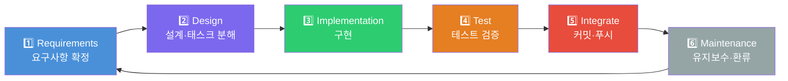
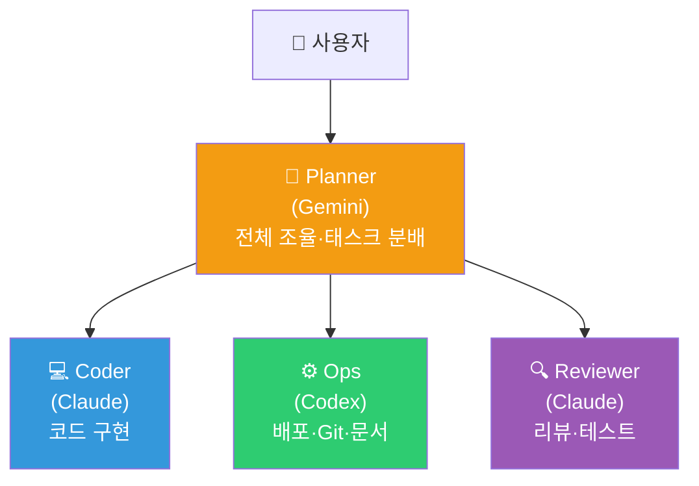
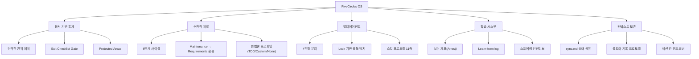

## 목차

- 1. FiveCircles
- 1.1 FiveCircles란 무엇인가
- 1.2 왜 FiveCircles를 만들었는가
- 1.3 FiveCircles의 기본 구조
- 1.4 NoSpoiler 작업 흐름에서 FiveCircles의 역할
- 1.5 FiveCircles 에이전트 운영시스템 분석
- 1.5.1 개요
- 1.5.2 디렉토리 구조 & 역할
- 1.5.3 6단계 개발 사이클
- 1.5.4 멀티에이전트 협업 체계
- 1.5.5 거버넌스 & 문서 권위 체계
- 1.5.6 스킬 시스템
- 1.5.7 에이전트 성과 평가
- 1.5.8 지식 관리 & 학습 루프
- 1.5.9 실제 운영 현황
- 1.5.10 설계 특징 요약

## 1. FiveCircles

### &nbsp;&nbsp;1.1 FiveCircles란 무엇인가

FiveCircles는 NoSpoiler 프로젝트에서 사용하는 **개발 운영 프레임워크이자 작업 운영체제**에 가깝다.  
단순한 문서 폴더가 아니라, 요구사항 정리부터 설계, 구현, 테스트, 커밋, 유지보수까지를 하나의 반복 가능한 사이클로 관리하기 위한 작업 규칙 묶음이다.

기본 개념은 `개발 5사이클(+Integrate)` 이다.

1. Requirements
2. Design
3. Implementation
4. Test
5. Integrate
6. Maintenance

즉 FiveCircles는 “어떻게 코드를 작성할 것인가”보다, **어떻게 맥락을 잃지 않고 프로젝트를 지속적으로 운영할 것인가**에 더 가까운 체계이다.

### &nbsp;&nbsp;1.2 왜 FiveCircles를 만들었는가

NoSpoiler는 일반적인 CRUD 프로젝트보다 문서, 규칙, 시맨틱 구조, QA 템플릿, 배포 정책이 많이 얽혀 있다.  
이런 프로젝트는 세션이 바뀌거나 작업자가 바뀌면 쉽게 맥락이 끊기고, “왜 이렇게 만들었는지”가 사라지기 쉽다.

FiveCircles는 이 문제를 줄이기 위해 만들었다.

- 요구사항과 결정사항을 문서로 고정
- 설계와 구현을 분리
- 테스트와 실패 기록을 누적
- 커밋과 운영 이력을 남김
- 새 세션이나 다른 에이전트가 들어와도 같은 구조로 다시 시작 가능하게 함

즉 FiveCircles의 목적은 단순 기록이 아니라, **프로젝트의 의사결정과 구현 맥락을 지속 가능하게 만드는 것**이다.

### &nbsp;&nbsp;1.3 FiveCircles의 기본 구조

`fivecircles/README.md` 기준으로 보면 FiveCircles는 다음 구조를 가진다.

- `requirements/`: 요구사항과 합의된 결정
- `architecture/specs/`: 기술 설계와 스펙
- `architecture/todolist.md`: 작업 배치와 다음 할 일
- `work/`: 실행 로그와 업데이트 기록
- `test/`: 테스트 정책, 실패 로그, 재발 방지
- `maintenance/`: 유지보수 및 환류
- `scoring/`: 에이전트 작업 품질 관리

즉 FiveCircles는 “문서 몇 개”가 아니라, **요구사항-설계-구현-검증-유지보수를 연결하는 프로젝트 운영 구조**이다.

### &nbsp;&nbsp;1.4 NoSpoiler 작업 흐름에서 FiveCircles의 역할

NoSpoiler에서는 기능 구현 전에 관련 스펙을 먼저 확인하고, 작업 중에는 투두와 로그를 갱신하며, 작업 후에는 테스트와 기록을 남기는 흐름을 중요하게 본다.  
이 과정에서 FiveCircles는 다음 역할을 맡는다.

- 현재 해야 할 일의 우선순위 정리
- 구현 전 참고해야 할 설계 기준 제공
- 작업 중 변경 이유와 범위를 기록
- 테스트 실패와 재발 방지 포인트 축적
- 새 세션에서도 동일한 작업 맥락 복원

즉 FiveCircles는 단순한 문서 폴더가 아니라, **프로젝트의 기억을 유지하고 작업 프로세스를 연결하는 운영 프레임워크**이다.

### &nbsp;&nbsp;1.5 FiveCircles 에이전트 운영시스템 분석

> **분석 대상**: [README.md](./README.md)
> **분석 일자**: 2026-03-17

#### &nbsp;&nbsp;&nbsp;&nbsp;1.5.1 개요

**FiveCircles**는 AI 에이전트(LLM)가 소프트웨어 개발을 체계적으로 수행할 수 있도록 설계된 **에이전트 운영체제(Agent OS)** 템플릿입니다. "개발 5사이클 + Integrate"라는 6단계 개발 프레임워크를 핵심으로, 요구사항 관리부터 배포·유지보수까지 전 과정을 **문서 기반(Document-Driven)**으로 통제합니다.

> [!IMPORTANT]
> 핵심 설계 원칙: **새 에이전트 세션이 시작되어도 `fivecircles/README.md`를 읽으면 컨텍스트 손실을 최소화**할 수 있도록 모든 맥락이 파일 시스템에 기록됩니다.

#### &nbsp;&nbsp;&nbsp;&nbsp;1.5.2 디렉토리 구조 & 역할

```text
fivecircles/
├── agent/           # 🤖 에이전트 행동 규칙, 협업 프로토콜, 스킬
├── architecture/    # 📐 설계 스펙, 태스크 분해(Todo), 제안서
├── requirements/    # 📋 요구사항 정의, 논쟁(Debate), 확정 결정
├── work/            # 📝 실행 로그, 업데이트 기록, 작업 정책
├── test/            # 🧪 테스트 정책, 에러 로그, 검증 스크립트
├── scoring/         # 🏆 에이전트 성과 평가 및 최적화
├── maintenance/     # 🔧 유지보수, 새 요구사항 환류
└── docs/            # 📚 운영 인시던트, Ops 문서
```

| 폴더 | 문서 권위 | 역할 |
|------|----------|------|
| `agent/` | ★★★★★ | 운영 절차, 정책, 워크플로우의 **최고 권위** 소스 |
| `requirements/` | ★★★★ | 요구사항 확정 및 논쟁 기록 |
| `architecture/specs/` | ★★★ | 기술 분석·설계 (API, DB, 온톨로지 등 50+ 파일) |
| `architecture/todolist.md` | ★★ | 태스크 분해 및 배치 플랜 (87KB, 실제 활발히 사용) |
| `work/` | ★ | 실행 로그 (비권위 증거) |
| `scoring/` | ☆ | 성과 평가 (선택 사항) |

#### &nbsp;&nbsp;&nbsp;&nbsp;1.5.3 6단계 개발 사이클

FiveCircles의 핵심인 **6-Stage Development Cycle**은 다음과 같은 순환 구조입니다:



각 단계에는 **Exit Checklist**가 정의되어 있어, 조건을 만족해야만 다음 단계로 진행 가능합니다:

| 단계 | 핵심 산출물 | Exit 조건 (필수) |
|------|-----------|-------|
| **Requirements** | `requirements/current.md`, `decisions.md` | DoD 1개+, 범위(in/out) 명시, 확정 결정 기록 |
| **Design** | `architecture/todolist.md`, `specs/*` | 태스크가 작은 산출물로 분해, 테스트 접근법 기재 |
| **Implementation** | 코드 변경, `work/update.md` | 변경점(what/why) 로그, 최소 1개 기능 완료 |
| **Test** | 테스트 결과, `test/errorlogs/` | unit/integration 통과, 리그레션 체크 |
| **Integrate** | Git commit/push | format/lint pass, clean status, commit hash 기록 |
| **Maintenance** | `maintenance/` 업데이트 | 기술부채 기록, 새 요구사항 환류 |

> [!CAUTION]
> **Hard Gates**: 테스트 미통과 시 Integrate 금지, git push는 Integrate 단계에서만 허용, 증거 없는 "pass" 기록 금지

#### &nbsp;&nbsp;&nbsp;&nbsp;1.5.4 멀티에이전트 협업 체계

FiveCircles는 **4종의 에이전트 역할**을 정의하고, Planner를 중심으로 한 계층적 협업 구조를 운영합니다:



| 역할 | 에이전트 | 권한 | 금지 사항 |
|------|---------|------|----------|
| **Planner** | Gemini | 모든 에이전트에게 지시, 태스크 생성/할당 | 코드 직접 수정 |
| **Coder** | Claude | 담당 서비스 파일 읽기/쓰기 | Planner 지시 없이 작업 시작 |
| **Ops** | Codex | 인프라/배포, Git 명령, 문서 편집 | 서비스 코드 수정 |
| **Reviewer** | Claude | 읽기 전용, 버그 태스크 생성 | 코드 직접 수정 |

### 협업 통신 메커니즘

- **동기화**: [sync.md](./agent/sync.md) — 에이전트 간 현재 상태 및 메시지 공유
- **태스크 큐**: [queue.json](./agent/queue.json) — 태스크 할당·상태 관리 (`pending → in_progress → review → completed`)
- **파일 락**: `locks/` 디렉토리 — JSON 기반 Lock/Unlock으로 동시 수정 방지 (TTL 기반 만료)
- **긴급 통보**: sync.md 최상단 `[URGENT]` 태그

#### &nbsp;&nbsp;&nbsp;&nbsp;1.5.5 거버넌스 & 문서 권위 체계

문서 간 충돌 시 **엄격한 우선순위 체계**를 따릅니다:

```text
1) agent/workflow.md          ← 최고 권위
2) agent/policies.md
3) agent/methodology.md
4) requirements/decisions.md
5) requirements/current.md
6) specs/*
7) architecture/todolist.md
8) work/*                     ← 최저 (비권위 증거)
9) scoring/*                  ← 선택적
```

**Protected Areas**: `agent/`, `requirements/decisions.md`, `test/testpolicy.md`는 변경 전 반드시 사유·범위·롤백 방법을 기록해야 합니다.

#### &nbsp;&nbsp;&nbsp;&nbsp;1.5.6 스킬 시스템 (Agent Skills)

FiveCircles는 에이전트가 특정 명령어로 발동할 수 있는 **11개 프로토콜 스킬**을 정의합니다:

| 스킬 | 발동 명령어 | 역할 |
|------|-----------|------|
| 🔴 **울트라 기록** | `"울트라 기록해"` | 세션 종료 시 로그·에러·스코어링·동기화 일괄 수행 |
| 🟡 **빠른 디버깅** | `"빠른 디버깅해"` | `mistakes-arrest`, `learn-from-log` 검색 후 해결책 탐색 |
| 🟢 **로그 요약** | `"로그 요약해"` | update/todo/sync/error 기록 표준화 |
| 🔵 **동료 리뷰** | `"리뷰해"` | `debate.md` 중심 의사결정 검토 |
| ⚪ **운영방침 초기화** | `"운영방침 초기화"` | 에이전트 역할·맥락 재설정 |
| 🟠 **테스트 실행** | `"테스트 실행"` | 규정된 환경에서 테스트 수행 |
| 🟣 **배포** / **서버 배포** | `"배포해"` / `"서버 배포해"` | Vercel 또는 SSH 기반 배포 |
| ⚫ **톺아보기** | `"톺아보기"` | 로그 분석 후 다음 작업 설정 |

#### &nbsp;&nbsp;&nbsp;&nbsp;1.5.7 에이전트 성과 평가 (Scoring System)

에이전트의 작업 품질을 **정량적으로 평가**하는 인센티브 시스템입니다:

##### &nbsp;&nbsp;&nbsp;&nbsp;&nbsp;&nbsp;점수 체계

| 범주 | 항목 | 점수 |
|------|------|------|
| **Progress** | 태스크 1개 완료 | +30 |
| **Quality** | 필수 테스트 통과 | +40 |
| **Quality** | 핵심 평가축 검증 | +50 |
| **Spec Violation** | workflow/data-model 위반 | **-120** |
| **Ops Efficiency** | 같은 에러 3회 반복 | **-80** |

##### &nbsp;&nbsp;&nbsp;&nbsp;&nbsp;&nbsp;레벨 시스템

| 레벨 | 필요 점수 | 권한 |
|------|----------|------|
| Lv0 | 0–99 | 단일 태스크만 |
| Lv1 | 100–299 | 다중 단계 태스크 |
| Lv2 | 300–599 | 크로스 서비스 작업 |
| Lv3 | 600+ | **스펙 진화 제안 가능** |

> [!NOTE]
> 실제 운영 기록 [log-score.md](./scoring/log-score.md)에서 세션별 점수가 누적 관리되고 있으며, MinIO 리팩토링 세션에서 **Lv2**로 승급한 기록이 확인됩니다.

#### &nbsp;&nbsp;&nbsp;&nbsp;1.5.8 지식 관리 & 학습 루프

FiveCircles는 에이전트의 **반복 실수 방지**와 **지식 축적**을 위한 여러 메커니즘을 갖추고 있습니다:

| 파일 | 용도 |
|------|------|
| [learn-from-log.md](./test/learn-from-log.md) (12KB) | 런타임 교훈 기록 — 구현 전 반드시 참조 |
| [mistakes-arrest.md](./agent/mistakes-arrest.md) (10KB) | 반복 실수 목록 및 체포(Arrest) 기록 |
| [mistakes-repeating.md](./agent/mistakes-repeating.md) | 반복 발생 실수 패턴 분석 |
| [debate.md](./agent/debate.md) (19KB) | 기술적 의사결정 논쟁 기록 |
| [optimization.md](./scoring/optimization.md) | 더 높은 점수를 얻을 수 있었던 경로 기록 |

**학습 루프**: 에러 발생 → `test/errorlogs/` 기록 → `learn-from-log.md` 원인·방지책 정리 → 다음 구현 전 참조

#### &nbsp;&nbsp;&nbsp;&nbsp;1.5.9 실제 운영 현황

`sync.md`와 `log-score.md`에서 확인한 **실제 운영 이력**:

- **활성 에이전트**: Gemini (Coder, Team C), Antigravity (Coder, Frontend/Admin)
- **현재 스프린트**: MVP-1 Implementation & Remote Testing Setup
- **완료 태스크**: PRECEDES Curation UI, V2.5 UI Components, MinIO Refactoring, Authoring Studio 등
- **리뷰 진행 중**: `feature/admin-event-edit` 브랜치 (41 commits, 152 files)
- **누적 스코어**: 세션별 55~245 포인트 기록, Lv2 도달

#### &nbsp;&nbsp;&nbsp;&nbsp;1.5.10 설계 특징 요약



| 강점 | 설명 |
|------|------|
| **컨텍스트 불멸성** | 모든 결정·로그·상태가 파일에 남아 새 세션에서도 즉시 복원 가능 |
| **실수 방지 루프** | `mistakes-arrest` → `learn-from-log` → 구현 전 검토로 반복 실수 차단 |
| **정량적 동기부여** | 점수제로 에이전트의 스펙 준수와 품질을 수치화 |
| **확장 가능한 협업** | Lock/Queue/Sync 기반으로 여러 에이전트가 동시 작업 가능 |
