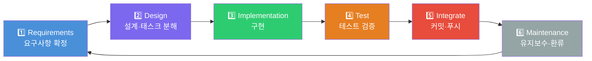
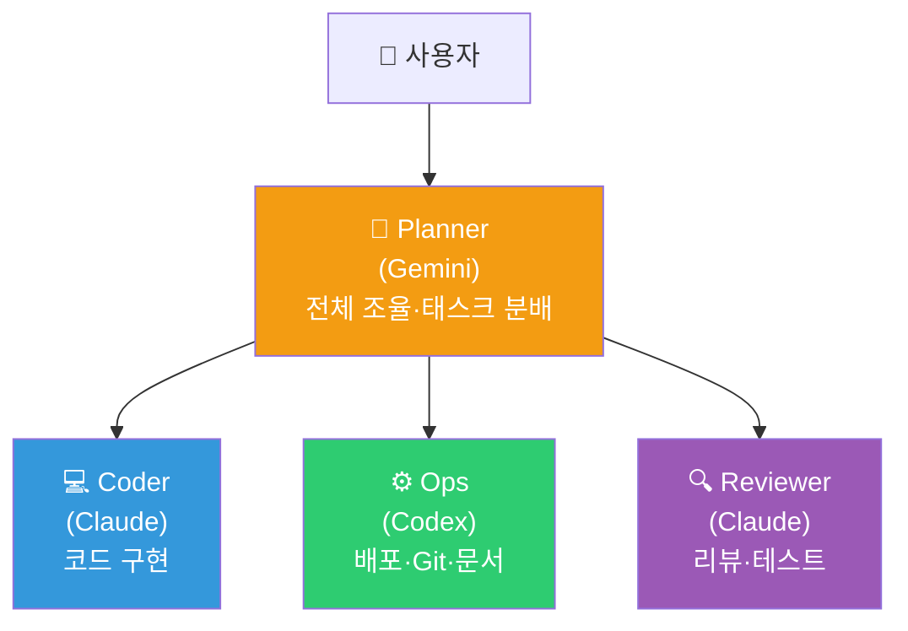
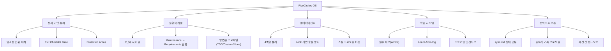

> **분석 대상**: [fivecircles/](file:///Users/pio/IdeaProjects/nospoiler/fivecircles)
> **분석 일자**: 2026-03-17

#### &nbsp;&nbsp;&nbsp;&nbsp;2.10.5.1 개요

**FiveCircles**는 AI 에이전트(LLM)가 소프트웨어 개발을 체계적으로 수행할 수 있도록 설계된 **에이전트 운영체제(Agent OS)** 템플릿입니다. "개발 5사이클 + Integrate"라는 6단계 개발 프레임워크를 핵심으로, 요구사항 관리부터 배포·유지보수까지 전 과정을 **문서 기반(Document-Driven)**으로 통제합니다.

> [!IMPORTANT]
> 핵심 설계 원칙: **새 에이전트 세션이 시작되어도 `fivecircles/README.md`를 읽으면 컨텍스트 손실을 최소화**할 수 있도록 모든 맥락이 파일 시스템에 기록됩니다.

#### &nbsp;&nbsp;&nbsp;&nbsp;2.10.5.2 디렉토리 구조 & 역할

```text
fivecircles/
├── agent/           # 🤖 에이전트 행동 규칙, 협업 프로토콜, 스킬
├── architecture/    # 📐 설계 스펙, 태스크 분해(Todo), 제안서
├── requirements/    # 📋 요구사항 정의, 논쟁(Debate), 확정 결정
├── work/            # 📝 실행 로그, 업데이트 기록, 작업 정책
├── test/            # 🧪 테스트 정책, 에러 로그, 검증 스크립트
├── scoring/         # 🏆 에이전트 성과 평가 및 최적화
├── maintenance/     # 🔧 유지보수, 새 요구사항 환류
└── docs/            # 📚 운영 인시던트, Ops 문서
```

| 폴더 | 문서 권위 | 역할 |
|------|----------|------|
| `agent/` | ★★★★★ | 운영 절차, 정책, 워크플로우의 **최고 권위** 소스 |
| `requirements/` | ★★★★ | 요구사항 확정 및 논쟁 기록 |
| `architecture/specs/` | ★★★ | 기술 분석·설계 (API, DB, 온톨로지 등 50+ 파일) |
| `architecture/todolist.md` | ★★ | 태스크 분해 및 배치 플랜 (87KB, 실제 활발히 사용) |
| `work/` | ★ | 실행 로그 (비권위 증거) |
| `scoring/` | ☆ | 성과 평가 (선택 사항) |

#### &nbsp;&nbsp;&nbsp;&nbsp;2.10.5.3 6단계 개발 사이클

FiveCircles의 핵심인 **6-Stage Development Cycle**은 다음과 같은 순환 구조입니다:



> 대체 이미지 삽입 위치: `docs/프레젠테이션/배경지식/assets/fivecircles-6-stage-cycle.png`

각 단계에는 **Exit Checklist**가 정의되어 있어, 조건을 만족해야만 다음 단계로 진행 가능합니다:

| 단계 | 핵심 산출물 | Exit 조건 (필수) |
|------|-----------|-------|
| **Requirements** | `requirements/current.md`, `decisions.md` | DoD 1개+, 범위(in/out) 명시, 확정 결정 기록 |
| **Design** | `architecture/todolist.md`, `specs/*` | 태스크가 작은 산출물로 분해, 테스트 접근법 기재 |
| **Implementation** | 코드 변경, `work/update.md` | 변경점(what/why) 로그, 최소 1개 기능 완료 |
| **Test** | 테스트 결과, `test/errorlogs/` | unit/integration 통과, 리그레션 체크 |
| **Integrate** | Git commit/push | format/lint pass, clean status, commit hash 기록 |
| **Maintenance** | `maintenance/` 업데이트 | 기술부채 기록, 새 요구사항 환류 |

> [!CAUTION]
> **Hard Gates**: 테스트 미통과 시 Integrate 금지, git push는 Integrate 단계에서만 허용, 증거 없는 "pass" 기록 금지

#### &nbsp;&nbsp;&nbsp;&nbsp;2.10.5.4 멀티에이전트 협업 체계

FiveCircles는 **4종의 에이전트 역할**을 정의하고, Planner를 중심으로 한 계층적 협업 구조를 운영합니다:



> 대체 이미지 삽입 위치: `docs/프레젠테이션/배경지식/assets/fivecircles-multi-agent-collaboration.png`

| 역할 | 에이전트 | 권한 | 금지 사항 |
|------|---------|------|----------|
| **Planner** | Gemini | 모든 에이전트에게 지시, 태스크 생성/할당 | 코드 직접 수정 |
| **Coder** | Claude | 담당 서비스 파일 읽기/쓰기 | Planner 지시 없이 작업 시작 |
| **Ops** | Codex | 인프라/배포, Git 명령, 문서 편집 | 서비스 코드 수정 |
| **Reviewer** | Claude | 읽기 전용, 버그 태스크 생성 | 코드 직접 수정 |

### 협업 통신 메커니즘

- **동기화**: [sync.md](file:///Users/pio/IdeaProjects/nospoiler/fivecircles/agent/sync.md) — 에이전트 간 현재 상태 및 메시지 공유
- **태스크 큐**: [queue.json](file:///Users/pio/IdeaProjects/nospoiler/fivecircles/agent/queue.json) — 태스크 할당·상태 관리 (`pending → in_progress → review → completed`)
- **파일 락**: `locks/` 디렉토리 — JSON 기반 Lock/Unlock으로 동시 수정 방지 (TTL 기반 만료)
- **긴급 통보**: sync.md 최상단 `[URGENT]` 태그

#### &nbsp;&nbsp;&nbsp;&nbsp;2.10.5.5 거버넌스 & 문서 권위 체계

문서 간 충돌 시 **엄격한 우선순위 체계**를 따릅니다:

```text
1) agent/workflow.md          ← 최고 권위
2) agent/policies.md
3) agent/methodology.md
4) requirements/decisions.md
5) requirements/current.md
6) specs/*
7) architecture/todolist.md
8) work/*                     ← 최저 (비권위 증거)
9) scoring/*                  ← 선택적
```

**Protected Areas**: `agent/`, `requirements/decisions.md`, `test/testpolicy.md`는 변경 전 반드시 사유·범위·롤백 방법을 기록해야 합니다.

#### &nbsp;&nbsp;&nbsp;&nbsp;2.10.5.6 스킬 시스템 (Agent Skills)

FiveCircles는 에이전트가 특정 명령어로 발동할 수 있는 **11개 프로토콜 스킬**을 정의합니다:

| 스킬 | 발동 명령어 | 역할 |
|------|-----------|------|
| 🔴 **울트라 기록** | `"울트라 기록해"` | 세션 종료 시 로그·에러·스코어링·동기화 일괄 수행 |
| 🟡 **빠른 디버깅** | `"빠른 디버깅해"` | `mistakes-arrest`, `learn-from-log` 검색 후 해결책 탐색 |
| 🟢 **로그 요약** | `"로그 요약해"` | update/todo/sync/error 기록 표준화 |
| 🔵 **동료 리뷰** | `"리뷰해"` | `debate.md` 중심 의사결정 검토 |
| ⚪ **운영방침 초기화** | `"운영방침 초기화"` | 에이전트 역할·맥락 재설정 |
| 🟠 **테스트 실행** | `"테스트 실행"` | 규정된 환경에서 테스트 수행 |
| 🟣 **배포** / **서버 배포** | `"배포해"` / `"서버 배포해"` | Vercel 또는 SSH 기반 배포 |
| ⚫ **톺아보기** | `"톺아보기"` | 로그 분석 후 다음 작업 설정 |

#### &nbsp;&nbsp;&nbsp;&nbsp;2.10.5.7 에이전트 성과 평가 (Scoring System)

에이전트의 작업 품질을 **정량적으로 평가**하는 인센티브 시스템입니다:

##### &nbsp;&nbsp;&nbsp;&nbsp;&nbsp;&nbsp;점수 체계

| 범주 | 항목 | 점수 |
|------|------|------|
| **Progress** | 태스크 1개 완료 | +30 |
| **Quality** | 필수 테스트 통과 | +40 |
| **Quality** | 핵심 평가축 검증 | +50 |
| **Spec Violation** | workflow/data-model 위반 | **-120** |
| **Ops Efficiency** | 같은 에러 3회 반복 | **-80** |

##### &nbsp;&nbsp;&nbsp;&nbsp;&nbsp;&nbsp;레벨 시스템

| 레벨 | 필요 점수 | 권한 |
|------|----------|------|
| Lv0 | 0–99 | 단일 태스크만 |
| Lv1 | 100–299 | 다중 단계 태스크 |
| Lv2 | 300–599 | 크로스 서비스 작업 |
| Lv3 | 600+ | **스펙 진화 제안 가능** |

> [!NOTE]
> 실제 운영 기록 [log-score.md](file:///Users/pio/IdeaProjects/nospoiler/fivecircles/scoring/log-score.md)에서 세션별 점수가 누적 관리되고 있으며, MinIO 리팩토링 세션에서 **Lv2**로 승급한 기록이 확인됩니다.

#### &nbsp;&nbsp;&nbsp;&nbsp;2.10.5.8 지식 관리 & 학습 루프

FiveCircles는 에이전트의 **반복 실수 방지**와 **지식 축적**을 위한 여러 메커니즘을 갖추고 있습니다:

| 파일 | 용도 |
|------|------|
| [learn-from-log.md](file:///Users/pio/IdeaProjects/nospoiler/fivecircles/test/learn-from-log.md) (12KB) | 런타임 교훈 기록 — 구현 전 반드시 참조 |
| [mistakes-arrest.md](file:///Users/pio/IdeaProjects/nospoiler/fivecircles/agent/mistakes-arrest.md) (10KB) | 반복 실수 목록 및 체포(Arrest) 기록 |
| [mistakes-repeating.md](file:///Users/pio/IdeaProjects/nospoiler/fivecircles/agent/mistakes-repeating.md) | 반복 발생 실수 패턴 분석 |
| [debate.md](file:///Users/pio/IdeaProjects/nospoiler/fivecircles/agent/debate.md) (19KB) | 기술적 의사결정 논쟁 기록 |
| [optimization.md](file:///Users/pio/IdeaProjects/nospoiler/fivecircles/scoring/optimization.md) | 더 높은 점수를 얻을 수 있었던 경로 기록 |

**학습 루프**: 에러 발생 → `test/errorlogs/` 기록 → `learn-from-log.md` 원인·방지책 정리 → 다음 구현 전 참조

#### &nbsp;&nbsp;&nbsp;&nbsp;2.10.5.9 실제 운영 현황

`sync.md`와 `log-score.md`에서 확인한 **실제 운영 이력**:

- **활성 에이전트**: Gemini (Coder, Team C), Antigravity (Coder, Frontend/Admin)
- **현재 스프린트**: MVP-1 Implementation & Remote Testing Setup
- **완료 태스크**: PRECEDES Curation UI, V2.5 UI Components, MinIO Refactoring, Authoring Studio 등
- **리뷰 진행 중**: `feature/admin-event-edit` 브랜치 (41 commits, 152 files)
- **누적 스코어**: 세션별 55~245 포인트 기록, Lv2 도달

#### &nbsp;&nbsp;&nbsp;&nbsp;2.10.5.10 설계 특징 요약



> 대체 이미지 삽입 위치: `docs/프레젠테이션/배경지식/assets/fivecircles-design-summary.png`

| 강점 | 설명 |
|------|------|
| **컨텍스트 불멸성** | 모든 결정·로그·상태가 파일에 남아 새 세션에서도 즉시 복원 가능 |
| **실수 방지 루프** | `mistakes-arrest` → `learn-from-log` → 구현 전 검토로 반복 실수 차단 |
| **정량적 동기부여** | 점수제로 에이전트의 스펙 준수와 품질을 수치화 |
| **확장 가능한 협업** | Lock/Queue/Sync 기반으로 여러 에이전트가 동시 작업 가능 |
